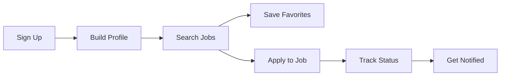
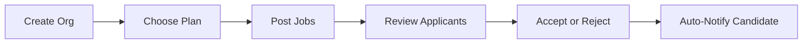
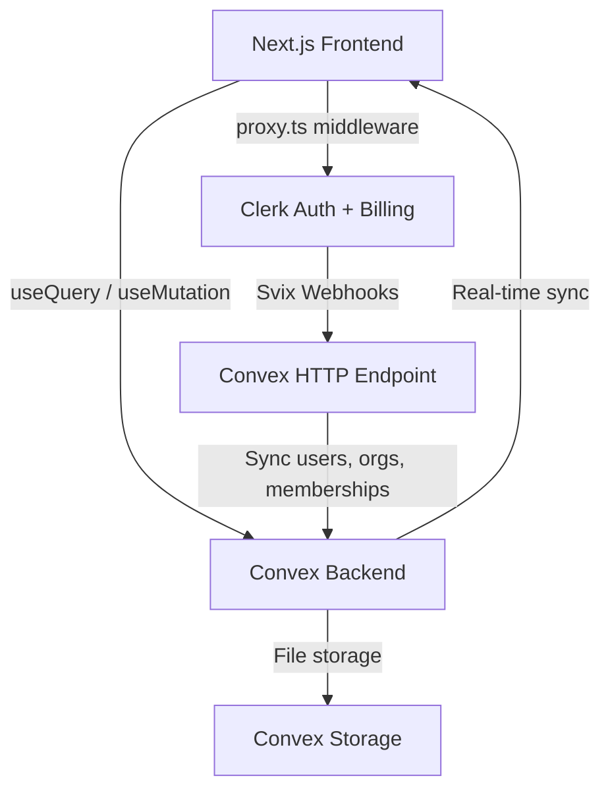

# Jobly — Find & Hire Experts for Any Job

[](LICENSE.md)
[](https://nextjs.org/)
[](https://convex.dev)
[](https://clerk.com)
[](https://tailwindcss.com/)
[](https://www.typescriptlang.org/)

> **⚠️ Disclaimer:** This is an **educational project** built for learning purposes only. "Jobly" is a fictional name used for this demo — we do not claim any trademark or intellectual property rights over it. This project is **not affiliated with, endorsed by, or connected to Indeed, LinkedIn, or any other job platform**. All company names, job listings, and user data in the seed files are entirely fictional. Third-party service names (Clerk, Convex, Vercel, Next.js, Tailwind CSS, etc.) are trademarks of their respective owners and are used here solely to describe the technologies used in this project.

A full-stack, real-time job board where **job seekers** search and apply for roles, and **employers** post jobs, review candidates, and manage their hiring pipeline — all from one app.

> **Who is this for?**
> Anyone who wants to learn how to build a production-grade, two-sided SaaS marketplace using modern tools — or anyone looking for a solid starter template to launch their own job platform.

> **What makes it different?**
> Every update is **real-time** (no page refreshes). Auth, billing, and organizations are handled by **Clerk**. The backend is powered by **Convex** — a reactive database that pushes changes to the client instantly. Multi-tenant company workspaces come built-in with role-based access control.

> **Under the hood**
> Next.js 16 App Router · Convex reactive backend · Clerk auth + organizations + billing · Tiptap rich text editor · shadcn/ui · Tailwind CSS v4 · Zod + React Hook Form · TypeScript strict mode

---

## 👇🏼 DO THIS Before You Get Started

You'll need free accounts on these services to run the app. **Set them up before cloning:**

| Service | What it does | Sign up |
|---------|-------------|---------|
| **Clerk** | Authentication, organizations, and billing | [Create a free Clerk account →](https://go.clerk.com/INxQv2R) |
| **Convex** | Real-time backend, database, and file storage | [Create a free Convex account →](https://convex.dev/referral/SONNYS4371) |
| **Vercel** *(optional)* | Deployment & hosting | [vercel.com →](https://vercel.com) |

---

## 🤔 What Is This App?

Think of Jobly as **your own mini job board** — similar in concept to platforms like Indeed or LinkedIn Jobs, but built from scratch as a learning project.

It's a two-sided job board with two completely different experiences depending on who you are:

**If you're a Job Seeker**, you can:
- Search and filter thousands of job listings
- Save your favorites for later
- Build a profile with your experience, education, and skills
- Upload resumes and apply with one click
- Track every application's status in real time

**If you're an Employer**, you can:
- Create a company workspace and invite your team
- Post job listings with a rich text editor
- Review every applicant's full profile, resume, and cover letter
- Accept or reject candidates (they get notified instantly)
- Manage billing and plan limits from a dashboard

**Popular use cases:**
- 🎓 **Portfolio project** — show off a full-stack SaaS app to employers
- 🚀 **SaaS starter** — fork it and customize it into your own niche job board
- 📚 **Learn real-time fullstack** — understand how Convex, Clerk, and Next.js work together

---

## 🚀 Before We Dive In — Join the PAPAFAM!

Want to build apps like this from scratch? Learn how to **vibe code the right way** with Cursor and AI.

### What You'll Master

- ⚡ **Next.js 16** — App Router, Server Components, route groups, and server actions
- 🔐 **Clerk** — Authentication, organizations, role-based access, and billing
- 🗄️ **Convex** — Real-time reactive backend, file storage, and database design
- 🤖 **AI-Powered Development** — Build faster with Cursor and learn the right way to work with AI coding tools
- 🎨 **Modern UI** — shadcn/ui, Tailwind CSS v4, and responsive design patterns

### The PAPAFAM Community

- 💬 Join thousands of developers building together
- 🏆 Real results from graduates who landed jobs and launched products
- 📦 Full course materials, starter code, and lifetime access

### What's Included

- Step-by-step video walkthroughs of real-world builds
- Private community access
- Code reviews and Q&A support
- Regular new project drops

👉 **[Join the PAPAFAM and start building →](https://www.papareact.com/course)**

---

## ✨ Features

### For Job Seekers

- 🔍 **Smart job search** — Filter by location, workplace type (remote / hybrid / on-site), employment type (full-time, part-time, contract, internship, temporary), salary range, and tags
- 📝 **Full-text search** — Powered by Convex search indexes across titles, descriptions, company names, locations, and tags
- ❤️ **Save favorites** — Bookmark jobs and revisit them anytime
- 📨 **One-click apply** — Submit an application with an optional cover letter
- 📊 **Application tracking** — See every application's status: Submitted → In Review → Accepted / Rejected / Withdrawn
- 👤 **Profile builder** — Add your experience, education, certifications, skills, and social links (LinkedIn, GitHub, website)
- 📄 **Resume management** — Upload up to 10 resumes (10 MB each), set a default, and download or delete anytime
- 🔔 **Real-time notifications** — Get notified when your application status changes, a job closes, or anything important happens
- 🟢 **Open-to-work toggle** — Let employers know you're available

### For Employers (Company Workspace)

- 🏢 **Multi-tenant workspaces** — Each company gets its own workspace powered by Clerk Organizations
- ✏️ **Job posting** — Create listings with a Tiptap rich text editor, salary range, tags, location, and auto-close settings
- 👀 **Application review** — View every candidate's full profile: cover letter, work history, education, certifications, skills, contact info, and uploaded resumes
- ⚡ **Hiring pipeline** — Move candidates through Submitted → In Review → Accepted / Rejected (candidates are notified at each step)
- 🔒 **Auto-close on accept** — Optionally close a job listing automatically when you accept a candidate
- 👥 **Role-based access** — Three roles: Admin (full access + billing), Recruiter (post jobs + make decisions), Member (read-only)
- 📩 **Team invitations** — Invite teammates to collaborate on hiring
- 📋 **Plan-based limits** — Job and seat limits enforced per plan

### Pricing Tiers (Features Only)

| | Free | Starter | Growth |
|---|---|---|---|
| **Team seats** | 1 | 3 | 10 |
| **Active job listings** | 1 | 5 | 25 |
| **Advanced filters** | — | — | ✅ Skills, years of experience |
| **Billing management** | — | ✅ | ✅ |

### Technical Features (The Smart Stuff)

- ⚛️ **Next.js 16 App Router** — Route groups, server components, and `proxy.ts` middleware
- 🔄 **Convex real-time backend** — No polling. Data changes push to every connected client instantly
- 🔐 **Clerk auth + webhooks** — User, organization, and membership events sync to Convex via Svix-verified webhooks
- 🏗️ **Clerk Organizations** — Multi-tenancy with role-based access out of the box
- 💳 **Clerk Billing** — `PricingTable` component for subscription management per organization
- ✍️ **Tiptap rich text editor** — For writing beautiful job descriptions
- 🧩 **shadcn/ui** — Pre-built accessible components (New York style)
- 🎨 **Tailwind CSS v4** — Custom theme with warm shadows, animations, and dark mode support
- ✅ **Zod + React Hook Form** — Type-safe form validation
- 📁 **Convex file storage** — Secure resume uploads with signed URLs
- 🌱 **Database seeding** — Realistic seed data script for development
- 📱 **Mobile-responsive** — Bottom navigation bar on mobile, full sidebar on desktop

---

## 🔄 How It Works

### Candidate Flow



### Employer Flow



### Architecture Overview



---

## 🏁 Getting Started

### Prerequisites

- **Node.js** 18 or later
- **pnpm** (package manager) — `npm install -g pnpm`
- A **[Clerk](https://go.clerk.com/INxQv2R)** account
- A **[Convex](https://convex.dev/referral/SONNYS4371)** account

### 1. Clone the repository

```bash
git clone https://github.com/YOUR_USERNAME/indeed-clone-clerk-nextjs-16.git
cd indeed-clone-clerk-nextjs-16
```

### 2. Install dependencies

```bash
pnpm install
```

### 3. Set up environment variables

```bash
cp .env.example .env.local
```

Open `.env.local` and fill in the values:

```env
# Clerk — https://go.clerk.com/INxQv2R
NEXT_PUBLIC_CLERK_PUBLISHABLE_KEY=pk_test_...
CLERK_SECRET_KEY=sk_test_...
NEXT_PUBLIC_CLERK_SIGN_IN_URL=/sign-in
NEXT_PUBLIC_CLERK_SIGN_UP_URL=/sign-up

# Convex — https://convex.dev/referral/SONNYS4371
NEXT_PUBLIC_CONVEX_URL=https://your-project.convex.cloud

# Clerk JWT issuer for Convex auth
CLERK_JWT_ISSUER_DOMAIN=https://your-clerk-instance.clerk.accounts.dev

# Clerk webhook signing secret (from Svix)
CLERK_WEBHOOK_SIGNING_SECRET=whsec_...
```

> 🔒 **Security:** Never commit `.env.local` to git. The `NEXT_PUBLIC_` prefix means the value is exposed to the browser — only use it for public keys like `NEXT_PUBLIC_CLERK_PUBLISHABLE_KEY`.

### 4. Set up Clerk

1. Go to your [Clerk Dashboard](https://go.clerk.com/INxQv2R) and create a new application
2. Copy your **Publishable Key** and **Secret Key** into `.env.local`
3. Enable **Organizations** in the Clerk dashboard (Settings → Organizations)
4. Set up **Billing** plans (Free, Starter, Growth) in the Clerk dashboard if you want subscription management
5. Create organization roles: `admin`, `recruiter`, `member`

### 5. Set up Convex

1. Run `npx convex dev` — this will prompt you to create a new project or link an existing one
2. Copy the **Convex URL** it gives you into `.env.local` as `NEXT_PUBLIC_CONVEX_URL`
3. Set the `CLERK_JWT_ISSUER_DOMAIN` environment variable in the [Convex dashboard](https://dashboard.convex.dev) (Settings → Environment Variables)

### 6. Configure Clerk Webhooks

This is how Clerk keeps your Convex database in sync with user and organization changes.

1. In your Clerk dashboard, go to **Webhooks** and create a new endpoint
2. Set the URL to: `https://YOUR_CONVEX_URL/webhooks/clerk`
   - Replace `YOUR_CONVEX_URL` with your Convex HTTP Actions URL (e.g. `https://your-project.convex.site/webhooks/clerk`)
3. Subscribe to these events:
   - `user.created`
   - `user.updated`
   - `user.deleted`
   - `organization.created`
   - `organization.updated`
   - `organization.deleted`
   - `organizationMembership.created`
   - `organizationMembership.updated`
   - `organizationMembership.deleted`
4. Copy the **Signing Secret** and add it to your Convex environment variables as `CLERK_WEBHOOK_SIGNING_SECRET`

### 7. Run the development server

```bash
pnpm dev
```

This runs both the Next.js frontend and the Convex backend in parallel. Open [http://localhost:3000](http://localhost:3000) to see the app.

### First-Time Setup Checklist

- [ ] Clerk account created and keys added to `.env.local`
- [ ] Convex project linked and URL added to `.env.local`
- [ ] Clerk Organizations enabled
- [ ] Clerk Webhooks configured and signing secret added to Convex env vars
- [ ] `pnpm dev` runs without errors
- [ ] You can sign up and see the home page

---

## 🗄️ Database Schema Overview

Jobly uses **Convex** as its database with a flat, relational schema design. All tables are defined in [`convex/schema.ts`](convex/schema.ts).

| Table | Purpose | Key Fields |
|-------|---------|------------|
| **users** | Synced from Clerk via webhooks | `clerkUserId`, `email`, `firstName`, `lastName`, `imageUrl` |
| **profiles** | Extended candidate profiles | `userId`, `headline`, `bio`, `skills[]`, `openToWork`, `yearsExperience` |
| **experiences** | Work history entries | `userId`, `title`, `company`, `startDate`, `isCurrent`, `order` |
| **education** | Education history | `userId`, `school`, `degree`, `fieldOfStudy`, `order` |
| **certifications** | Professional certifications | `userId`, `name`, `issuingOrg`, `credentialUrl` |
| **resumes** | Uploaded resume files | `userId`, `storageId`, `fileName`, `isDefault` |
| **companies** | Synced from Clerk Organizations | `clerkOrgId`, `name`, `plan`, `seatLimit`, `jobLimit` |
| **companyMembers** | Org membership with roles | `companyId`, `userId`, `role`, `status` |
| **jobListings** | Posted jobs | `companyId`, `title`, `description`, `salaryMin/Max`, `tags[]`, `isActive` |
| **applications** | Job applications from candidates | `jobId`, `applicantUserId`, `status`, `coverLetter`, `resumeId` |
| **favorites** | Bookmarked jobs | `userId`, `jobId` |
| **notifications** | In-app notifications | `userId`, `type`, `title`, `message`, `isRead` |

### Design Decisions

- **Flat, relational design** — No deep nesting. Tables reference each other by ID, following Convex best practices.
- **Clerk ID mapping** — `users` and `companies` store their Clerk IDs (`clerkUserId`, `clerkOrgId`) and are synced via webhooks so the Convex database is always up to date.
- **Search indexes** — `jobListings` has a full-text search index on `searchText` with filters for `isActive`, `companyId`, `workplaceType`, and `employmentType`.
- **Denormalized `companyName`** — Stored directly on `jobListings` to avoid extra lookups when displaying job cards.
- **Ordered collections** — `experiences` and `education` use an `order` field with a compound index for drag-and-drop reordering.

---

## 🚀 Deployment

### Deploy to Vercel

**Option A: Vercel CLI**

```bash
pnpm install -g vercel
vercel
```

**Option B: GitHub Integration**

1. Push your repo to GitHub
2. Go to [vercel.com/new](https://vercel.com/new)
3. Import your repository
4. Add all environment variables from `.env.local`
5. Deploy

### Deploy Convex to Production

```bash
npx convex deploy
```

This deploys your Convex functions and schema to a production deployment. Make sure to set all environment variables in the Convex production dashboard as well.

### Post-Deployment Checklist

- [ ] All environment variables set in Vercel (including `NEXT_PUBLIC_` vars)
- [ ] All environment variables set in Convex production (including `CLERK_WEBHOOK_SIGNING_SECRET`)
- [ ] Clerk webhook endpoint URL updated to production Convex HTTP Actions URL
- [ ] Clerk production API keys used (not development keys)
- [ ] Clerk Organizations and Billing configured for production
- [ ] Test sign-up, job creation, and application flow end-to-end

---

## 🐛 Common Issues & Solutions

### Development

| Problem | Solution |
|---------|----------|
| `pnpm dev` only starts one server | Make sure `npm-run-all2` is installed. The `dev` script runs `dev:frontend` and `dev:backend` in parallel. |
| Convex types not updating | Run `npx convex dev` in a separate terminal. It generates types in `convex/_generated/`. |
| Page shows "Loading..." forever | Check that `NEXT_PUBLIC_CONVEX_URL` is correct in `.env.local`. |

### Authentication

| Problem | Solution |
|---------|----------|
| Webhook returns 400 | Verify the signing secret matches. Make sure you're using `CLERK_WEBHOOK_SIGNING_SECRET` (not `CLERK_SECRET_KEY`). |
| User signs up but doesn't appear in Convex | Check that Clerk webhooks are configured and the endpoint URL points to your Convex HTTP Actions URL (`/webhooks/clerk`). |
| "Missing Svix headers" error | The webhook request isn't coming from Clerk. Verify the endpoint URL is correct. |

### Database

| Problem | Solution |
|---------|----------|
| "Index not found" error | Run `npx convex dev` to push your schema. Indexes are defined in `convex/schema.ts`. |
| Schema validation errors after changes | If you change field types, you may need to clear and re-seed. Run the seed function from the Convex dashboard. |

### Billing

| Problem | Solution |
|---------|----------|
| PricingTable not showing plans | Make sure Clerk Billing is enabled and plans are configured in the Clerk dashboard. |
| Plan not updating after payment | The plan is synced via Clerk organization metadata. Check that the organization webhook events are being received. |

---

## 🏆 Take It Further — Challenge Time!

Already have the base app running? Here are some ideas to make it your own:

### Advanced Features
- 🤖 **AI-powered job recommendations** — Use OpenAI to suggest jobs based on a candidate's profile
- 📧 **Email notifications** — Send emails when application status changes (Resend, SendGrid, etc.)
- 📊 **Analytics dashboard** — Show employers metrics like views, applications per job, time-to-hire
- 🔍 **Resume parsing** — Extract skills and experience from uploaded resumes using AI

### AI Improvements
- 💡 **AI cover letter generator** — Help candidates write cover letters based on the job description
- 🏷️ **Auto-tagging** — Automatically tag job listings based on description content
- 📝 **Job description templates** — AI-generated job descriptions from a brief prompt

### Infrastructure & Scaling
- ⚡ **Rate limiting** — Prevent abuse on application submissions
- 🔎 **Improved search** — Add fuzzy matching, synonym support, and search result ranking
- 📈 **Pagination** — Add cursor-based pagination for large job listing datasets

### Monetization
- ⭐ **Featured listings** — Let employers pay to boost their job posts
- 👑 **Premium profiles** — Give candidates enhanced visibility to employers
- 📬 **Job alerts** — Email candidates when new jobs match their saved filters

---

## 📜 License & Disclaimer

This project's source code is shared under the [Creative Commons Attribution-NonCommercial 4.0 International License](LICENSE.md) for **educational purposes only**.

### You CAN

- ✅ Use this project for **personal learning and education**
- ✅ Fork it and **modify** it for non-commercial purposes
- ✅ Share it with others (with attribution)
- ✅ Use it as a **portfolio project**
- ✅ Reference it in blog posts and tutorials

### You CANNOT

- ❌ Use it for **commercial purposes** without a separate license
- ❌ Sell it or include it in a paid product
- ❌ Remove the attribution or license notice

### Trademark Notice

"Jobly" is a fictional name used for this educational demo. We do not claim any trademark, copyright, or intellectual property rights over this name. If "Jobly" is a registered trademark belonging to another party, its use here is unintentional and purely for educational illustration. This project is **not affiliated with, endorsed by, or connected to Indeed, LinkedIn, or any other job platform or company**. All third-party names and logos (Clerk, Convex, Vercel, Next.js, React, Tailwind CSS, TypeScript, Tiptap, etc.) are trademarks of their respective owners.

See the full [LICENSE.md](LICENSE.md) for details.

---

## 📋 Quick Reference

### Useful Commands

| Command | What it does |
|---------|-------------|
| `pnpm dev` | Start both Next.js and Convex in parallel |
| `pnpm build` | Build the Next.js app for production |
| `pnpm start` | Start the production server |
| `pnpm lint` | Run ESLint across the project |
| `npx convex dev` | Start the Convex dev server (auto-generates types) |
| `npx convex deploy` | Deploy Convex to production |
| `npx convex dashboard` | Open the Convex dashboard in your browser |

### Key Files & Folders

| Path | Purpose |
|------|---------|
| `app/` | Next.js App Router pages and layouts |
| `app/(app)/` | Route group for candidate features (jobs, applications, favorites, profile, notifications) |
| `app/company/` | Route group for employer features (dashboard, jobs, applications, billing) |
| `app/pricing/` | Pricing page with Clerk PricingTable |
| `convex/` | Convex backend functions and schema |
| `convex/schema.ts` | Database schema definition |
| `convex/http.ts` | Clerk webhook HTTP endpoint |
| `convex/sync.ts` | Webhook sync logic (users, orgs, memberships) |
| `convex/seed.ts` | Database seeding script |
| `components/` | Shared React components |
| `components/ui/` | shadcn/ui components |
| `lib/` | Utility functions and hooks |
| `proxy.ts` | Clerk middleware for route protection |
| `.env.local` | Environment variables (not committed) |

### Important Concepts

- **Route Groups** — `(app)` and `company` are Next.js route groups that share different layouts. `(app)` has a candidate sidebar/nav, `company` has an employer sidebar.
- **Convex Functions** — Queries are reactive (auto-update the UI), mutations change data, actions talk to external APIs. All defined in the `convex/` directory.
- **Clerk Organizations** — Each company workspace is a Clerk organization. Users can belong to multiple organizations with different roles.
- **Webhook Sync** — When a user signs up or an organization is created in Clerk, a webhook fires and syncs the data to Convex. This keeps the two systems in sync without manual API calls.
- **`proxy.ts` Middleware** — Replaces traditional `middleware.ts` in Next.js 16. Protects routes and ensures company routes require organization membership.
